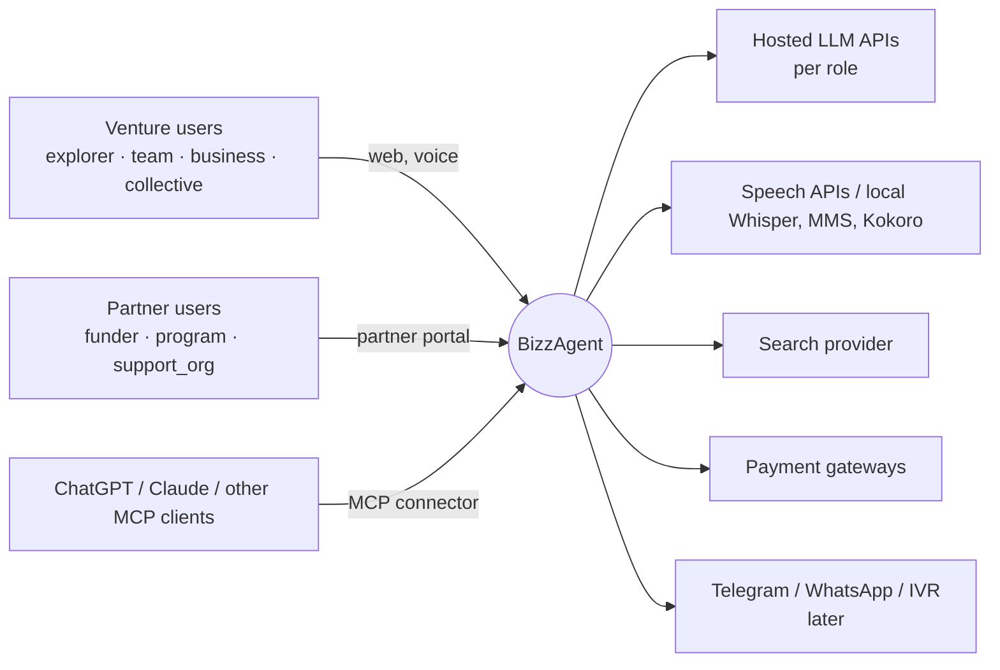
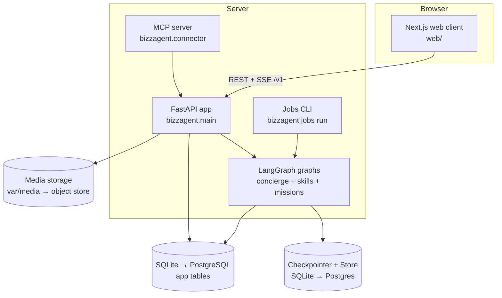
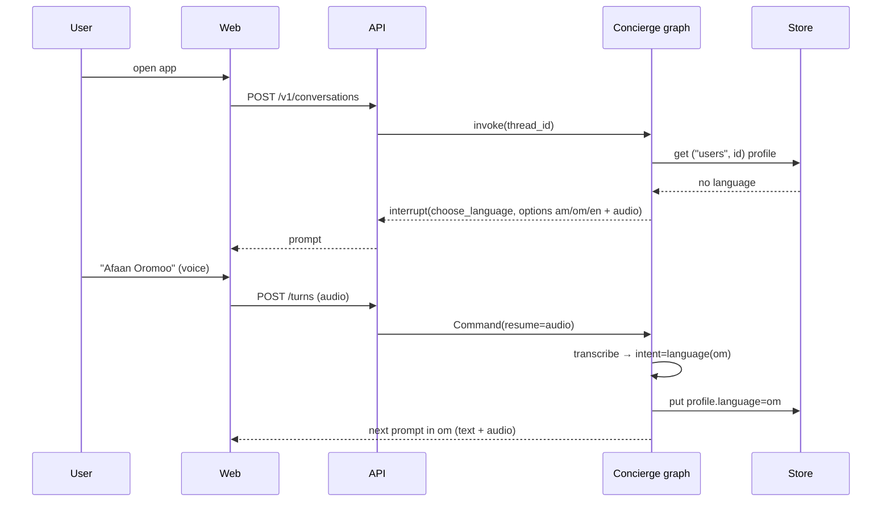
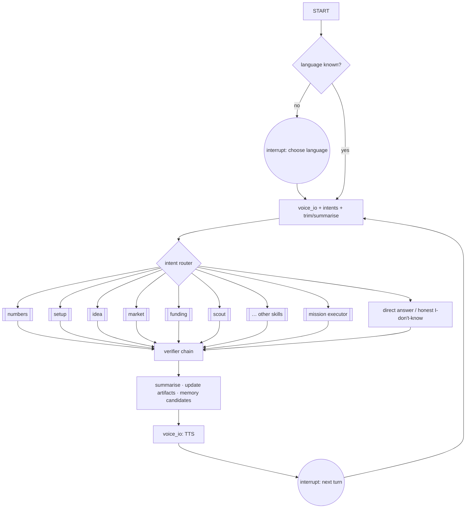

# BizzAgent — Software Architecture Document

> **What this is:** the architecture, following arc42 with C4 diagrams: context, containers, components, runtime sequences, deployment, cross-cutting concerns, quality, risks.
> **Who reads it:** engineers and reviewers. Read the [LangGraph primer](../onboarding/LANGGRAPH_PRIMER.md) alongside it.
> **Last reviewed:** 2026-10-02

Decisions are in [`adr/`](adr/). The skills are detailed in [agents.md](agents.md); the agentic
runtime is in [agent-operating-model.md](agent-operating-model.md).

## 1. Goals and constraints

**Quality goals, in priority order:**

1. **Honesty:** no fabricated facts, and provenance on every value.
2. **Language access:** am, om and en, with voice everywhere.
3. **Safety and privacy:** tenant isolation, a private personal space, consent.
4. **Recoverability:** durable threads and resumable missions.
5. **Changeability:** skills, countries, providers and channels are pluggable.

**Constraints:**

- Python 3.13 with FastAPI and LangGraph 1.2.x; Next.js 16 for the web.
- SQLite now, PostgreSQL before any external organisation is onboarded.
- Hosted model APIs in production, Ollama in development, fakes in CI.
- No secrets in the repo.

## 2. Context (C4 level 1)

## 3. Containers (C4 level 2)

## 4. Components (C4 level 3, package `bizzagent`)

Layering rule: `routes → services → agents → (calc | rules | knowledge | llm | speech | vision |
search | exports)`. Lower layers never import upper layers. **`calc`, `rules` and `knowledge`
are pure:** they import no LLM or LangChain modules, and an architecture test enforces this.

| Package | Responsibility |
|---|---|
| `config` | `Settings` from `BIZZAGENT_*` variables, with the model map per environment and role |
| `tenancy` | Users, organisations, memberships, consent, the `permissions.py` capability matrix, scoped repositories, auth |
| `billing` | Wallet, double-entry ledger, price list, usage events, payment adapters, the `charge_on_success` wrapper |
| `calc` | Pure calculators returning `Result{value, steps, inputs_used, warnings}` |
| `rules` | Proposal rules (call config, grid, gate, contradictions, gaps, declarations), setup rules, rubrics |
| `knowledge` | Country-pack loader, schema, retrieval (Store index + BM25), citations |
| `i18n` | Locales, language guard, number words, EC calendar, intents |
| `llm` | `init_chat_model` per role with fallbacks, usage capture, PII redaction, versioned prompts |
| `speech` / `vision` | ASR/TTS and OCR/VLM adapters (lazy, swappable) |
| `search` | `SearchProvider` (none · fake · hosted) and a page-snapshot cache |
| `opportunities` | Catalogue, sources, dedupe, eligibility, ranking, scam guard, freshness |
| `exports` | DOCX / PDF / XLSX / JSON renderers, templates, hash + `DocumentRecord` |
| `agents` | Concierge, skills, the mission core (missions, inbox, policy, verifiers, activity), the journey planner |
| `jobs` | Idempotent, cron-friendly background jobs |
| `connector` | MCP server |
| `routes/v1` | HTTP API; see [api.md](../engineering/api.md) |
| `legacy/interview` | The old interview loop; deleted in PR D |

## 5. Runtime views

### 5.1 First contact and language choice

### 5.2 Voice turn with read-back

`voice_io.listen` (ASR for the language) → `extract` → `readback` interrupt ("Did you say 8
employees?") → on "yes", write to the artifact with provenance `user_voice` → `speak`.

### 5.3 Handoff: concierge → skill → back

The intent router returns `numbers` → the numbers sub-graph runs → it finishes with
`Command(goto="summarise", graph=Command.PARENT, update={...})` → the concierge summarises and
speaks.

### 5.4 Language switch mid-skill

`PUT /v1/conversations/{id}/language` → `graph.update_state(config, {"language": "am"},
as_node="set_language")` → the pending interrupt prompt is re-phrased from its locale key, not
re-generated.

### 5.5 Numbers question with a calculation trace

The numbers skill fills its slots through interrupts → `ToolNode` calls `calc.margins.gross_margin`
→ the `Result.steps` are rendered as a ReceiptTape in the user's language → a `FinancialSheet`
artifact is saved → the rules verifier checks that every number shown equals `Result.value`.

### 5.6 Legal question: cited, or refused for lack of a source

Setup skill → `knowledge.retrieve(country="et", topic=...)`.

- **Entries found:** the answer is grounded to the entry ids, with a citation per paragraph.
- **No entries:** a template says "I don't have a verified source" and offers an advisor.

The grounding verifier rejects any paragraph that has no `knowledge(entry_id)` source.

### 5.7 Market research map-reduce

`plan_queries` → `Send("analyst", {...})` per competitor or segment, split into global and
local → each analyst runs `search` → extract facts with URL + `retrieved_at` → `reduce`:
dedupe, SWOT, price table, localisation gap → `MarketReport`.

### 5.8 Opportunity discovery → match → pipeline → proposal

1. Scout: profile snapshot → `Send` per (type, source) → collect → dedupe.
2. Eligibility (pure) → rank (pure) → explain fit (grounded) → the user picks (interrupt).
3. Add to the pipeline with a requirements checklist → hand off to the funding skill.

### 5.9 Watcher job refresh and reminder

`bizzagent jobs run deadline_reminders`:

1. Select pipeline items whose deadline is within N days and that have no reminder sent for that
   window.
2. Create an inbox item and a notification.
3. Record a run in `audit_events`.

A re-run is a no-op.

### 5.10 Market-entry plan

`choose_target` → research (`Send`) → `confirm_indicators` (read-back) → `attractiveness`
(pure) → `entry_mode` (rules) → `cost_to_enter` (calc) → `requirements` (cited or TODO) →
`MarketEntryPlan` + DOCX.

### 5.11 Proposal submit: on-platform vs export

- **Finalize** checks the invariants: declarations ticked by the user actor, drafts approved, no
  open blocking gaps (or an explicit acknowledgement).
- **Inbox approval card:**
  - On-platform: a `Submission` row, visible to that funder's reviewers.
  - Directory entry: an export, plus a `DocumentRecord` with hash and QR code.

### 5.12 Crash and resume

The process dies mid-mission. On restart, a new graph instance is compiled with the same
`SqliteSaver`. A job or event calls `graph.invoke(Command(resume=...), config={"thread_id":
mission_id})`. Execution continues from the last checkpoint. Side effects run after interrupts or
are idempotent.

## 6. Graph overview

## 7. Deployment

| Environment | Models | Speech | Data | Notes |
|---|---|---|---|---|
| CI | `fake` per role | fake | SQLite in a temp directory | No network; fake search |
| Local dev | Ollama models per role | local Whisper / Kokoro (extras) | SQLite in `backend/var/` | `langgraph dev` for Studio |
| Production | Hosted APIs per role, with fallbacks | Hosted speech where it supports am/om (verified per provider), else local | PostgreSQL + object storage | Keys from a secret manager; RLS before external organisations |

## 8. Cross-cutting concepts

- **Provenance.** [ADR-0007](adr/0007-provenance-model.md). It is carried on every artifact field
  and every document.
- **Configuration.**
  - Process settings come from `Settings`.
  - Run settings come from `context_schema=RuntimeContext`: org, country pack, enabled
    languages, the call configuration in the funding skill, and the autonomy policy.
- **Retries and fallbacks.** Every LLM node has a `RetryPolicy` and a deterministic fallback
  (template or ask the user). Each model role has `with_fallbacks`.
- **Streaming.** `stream_mode=["updates","custom"]`. Stage events come from `get_stream_writer()`
  and are relayed over SSE. The activity log consumes the same events.
- **Safety.** Untrusted input (transcripts, web pages, documents) is wrapped and never treated as
  instructions; see [security](../engineering/security-privacy-safety.md).
- **Logging.** Structured JSON with `run_id`, `thread_id`, skill, model per role, tokens and
  latency.
- **Idempotency.** Webhooks, jobs and post-interrupt side effects are keyed.

## 9. Architecture decisions

The ADR list is in [adr/README.md](adr/README.md).

## 10. Quality scenarios

| Scenario | Response | Measure |
|---|---|---|
| The model outputs Amharic text in Latin script | The language guard fails and a template fallback is used | 100% caught in tests |
| The model invents a tax threshold | The grounding verifier finds no pack source and removes the claim | 0 fabricated facts on the golden set |
| A foreign org requests an artifact | The scoped repository returns nothing | 404, tested |
| A server crash during a mission | Resume from the checkpoint | Mission completes; tested |
| A duplicate payment webhook | Ledger idempotency key | One credit; tested |
| The hosted model is down | Role fallback model, else a deterministic template | Turn still completes |

## 11. Risks and technical debt

| Risk | Mitigation |
|---|---|
| Legal/tax content wrong or stale | Citations required, `verified:false` until reviewed, `review_due`, advisor hand-off |
| Hallucinated competitors or opportunities | URL-or-drop, grounding check, page snapshots |
| Hosted-model cost, latency and outages | Per-role models, fallbacks, timeouts, caching, metering |
| PII sent to model APIs | Consent, redaction, provider terms reviewed |
| Dev/prod model quality gap | Evals against the production model set before release |
| Oromo ASR gap | MMS spike; text input always available |
| Cross-tenant leak | Scoped repositories, tests, RLS before external organisations |
| Over-autonomous agent | Conservative defaults, approvals, hard L3 exclusions, budgets, activity log |
| Docs drift | Docs are authoritative and updated in the same PR |

**Known debt:**

- The web TS rules engine duplicates `bizzagent.rules` until PR D.
- `legacy/interview` remains until PR D.
- SQLite is single-writer until Postgres.
