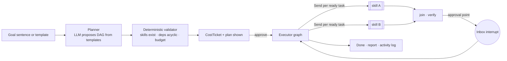

# Agent operating model

> **What this is:** what makes BizzAgent agentic. The agent card template, autonomy levels, missions, the inbox, standing instructions, verifiers, proactivity, humans in the loop, and the activity log.
> **Who reads it:** engineers building skills or the mission core, designers of the Inbox and Missions screens.
> **Last reviewed:** 2026-10-02

Decisions: [ADR-0032](adr/0032-autonomy-and-inbox.md), [ADR-0033](adr/0033-missions-as-durable-threads.md),
[ADR-0034](adr/0034-verifier-chain.md). Requirements: `FR-MIS`, `FR-INB`, `FR-AUT`, `FR-VFY`,
`FR-ACT`.

Agents pursue **goals over time**, not single replies.

## 1. The agent card

Every skill is specified in [agents.md](agents.md) with this card:

| Field | Meaning |
|---|---|
| **Goal** | The measurable outcome |
| **Triggers** | User request · watcher event · schedule · hand-off from another agent · external event (document uploaded, reply received, deadline approaching) |
| **Autonomy** | Default level and the maximum allowed |
| **Plan → act → verify → report** | Steps, checkpoints and the verifiers that run |
| **Tools and data** | What it reads and writes |
| **Approvals** | Which actions create an inbox card |
| **Budget** | Credits, time, attempts |
| **Memory** | What it reads and which candidates it may propose |
| **Outputs** | Artifacts |
| **Success criteria** | — |
| **Failure modes and fallbacks** | — |
| **Evals** | Named eval cases |

## 2. Autonomy levels

| Level | Name | Behaviour | Default for |
|---|---|---|---|
| **L0** | Suggest | Recommends; takes no action | Legal and financial decisions |
| **L1** | Draft | Prepares artifacts and messages for review | Most skills |
| **L2** | Act with approval | Performs the action after one approval card | Submit, share, send, book, spend above threshold, publish |
| **L3** | Autopilot within limits | Acts inside standing instructions, scope and budget, then reports | Opt-in only. **Never** for signing, legal submission, payments to third parties or personal-space data |

The level is set per skill and per mission in Settings → Autonomy, with plain-language
explanations in 3 languages. `agents/core/policy.py` is pure and decides, for each proposed
action, whether it is `allowed`, `needs_approval` or `forbidden`.

## 3. Missions

A mission is a multi-skill, long-running goal.

- Each mission is a durable LangGraph thread (`thread_id = mission_id`). It pauses on interrupts
  and external waits, and is resumed by jobs or events with `Command(resume=...)`.
- Tasks have owners: an agent or a named human member. A human task waits for completion through
  an inbox event.
- Missions can be paused, edited, cancelled, and **forked** through time travel ("try the other
  plan").

| Template | Flow |
|---|---|
| **Get funded** | readiness score → close top gaps → Common Application to top matches → funder-panel simulation → approve → submit → track |
| **Register my business** | legal-form recommendation → document checklist → forms → (book an agent, later) → reminders → update Passport |
| **Launch my MVP** | launch readiness (cited) → tech checklist → landing page → first-customer experiments → registration timing |
| **Get into an accelerator** | fit → application within limits → video script → mock interviews → reminders → follow-up |
| **Enter a new market** | target screen → cited requirements → entry mode → pilot → measure → go / no-go |
| **Validate my idea** | assumptions → interview script → log interviews by voice → synthesis → confidence update → next experiment |
| **Hire for a role** | JD → approved postings → applications → rubric screening → scheduling → offer → onboarding |
| **Monthly close** | import statements → categorise (confirm) → statements → KPI digest → anomalies → actions |

## 4. Agent Inbox

- **Approval cards** contain what, why, evidence, cost, and an undo window where possible.
  Types: submit, share Passport, send message, book expert, spend over threshold, publish
  posting.
- **Question cards** are missing facts, ordered by how many tasks they unblock.
- Approve or decline by tap, or **by voice with read-back**. Batch approval is allowed for cards
  of the same type.
- Implementation: `request_approval()` wraps `interrupt()`. The inbox lists pending interrupts
  across threads in the workspace.

## 5. Standing instructions

Users write plain-language rules. For example:

- "Alert me about grants for women-led agro-processing under Br 5M."
- "Auto-draft applications for matches above 80% fit; never submit."
- "Monthly budget: 300 credits."

Each rule is parsed into a typed `Policy` (LLM, structured output), **shown back** for
confirmation, stored in the Store under `("policies", workspace_id)`, and enforced
deterministically by `policy.py`.

## 6. Verifiers and critics

These run before any output reaches the user. Deterministic checks run first, LLM checks second.

| Verifier | Checks |
|---|---|
| Grounding | Every claim maps to a source: quote, document span, URL or pack entry |
| Rules | Calculation values equal `calc` results; eligibility and declaration invariants hold |
| Language | Script and language match the user's choice; legal text is reviewed text |
| Policy | Autonomy, scope, budget and standing instructions |
| Funder-eye critic | Scores a draft with the target call's rubric (deterministic) plus a grounded rationale |
| Red-team critic | Overclaims, missing risks, contradictions |

A failure means a bounded revision (at most 2 attempts), then an explicit "couldn't verify" shown
to the user. A failure never passes silently.

## 7. Proactivity

Watchers create inbox items, or start missions within standing instructions:

- opportunities
- deadlines
- compliance (EC dates)
- competitors
- prices
- ledger anomalies (margin drop, runway under N weeks)

They respect quiet hours and channel preferences. They run as jobs
([ADR-0020](adr/0020-background-jobs.md)).

## 8. Humans as team-mates

- Agents assign tasks to members, for example "Dawit: photograph this month's receipts". These
  arrive as web notifications now, and over Telegram later.
- Agents hand off to experts (marketplace, later) and to field officers (verification, later),
  then resume when they deliver.

## 9. Activity log

Every agent step, source used, approval given and credit spent is an `activity_event`. Events
come from the same custom stream events the UI shows. The log is exportable, and every artifact
links to the mission and agent that produced it.

## 10. Per-feature agentic upgrades

| Feature | Upgrade |
|---|---|
| Opportunity scout | Weekly autopilot scan → pre-drafts Common Applications (L1) → inbox (L2 submit) |
| Funding / accelerator | Funder-panel simulation with 3 rubric reviewers |
| Idea validation | Closed-loop experiments with an evidence board |
| Market entry | Pilot experiments tracked before go / no-go |
| Numbers / money | Anomaly detection, runway forecast, what-if forks, monthly close |
| Document explainer | Proposes calendar entries, expert review and tasks |
| Hiring | Publishes approved postings, collects voice applications, schedules interviews (sends are L2) |
| Growth coach | Weekly review loop |
| Learn mode | Adaptive tutor with explain-back by voice |
