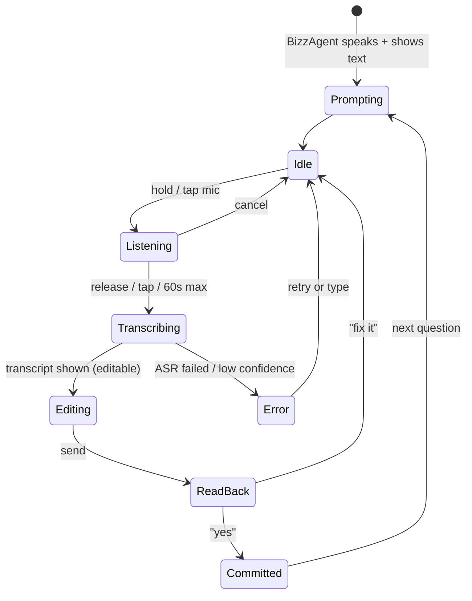

# Voice UI

> **What this is:** voice interaction behaviour. Turn states, timeouts, read-back, error recovery and helper mode.
> **Who reads it:** front-end engineers (VoicePill), engineers working on `voice_io`, designers.
> **Last reviewed:** 2026-10-02

## 1. Turn states

## 2. Timing

- **Maximum recording** 60 s per turn by default. Uploaded voice notes can be up to 5 min.
- **Silence:** after 3 s of silence while listening, show "Still listening… tap to finish".
- **Prompts** auto-play only after the user's first interaction (browser policy). After that,
  the user's auto-play preference applies.
- **Stage text** appears within 1 s of sending (`NFR-PERF-001`).

## 3. Read-back

- **Every value** that enters an artifact is read back in the user's language.
  - Numbers are spoken as words and shown as digits.
  - Dates are spoken and shown dual (EC/GC).
- "Yes" can be voice or tap. Voice approvals of **inbox cards** always repeat the action ("Submit
  the proposal to Highland Enterprise Fund?") before accepting.

## 4. Error recovery

| Situation | Behaviour |
|---|---|
| Microphone denied | Show text input; explain how to enable the mic; never block |
| Low ASR confidence | "I didn't catch that. Could you say it again, or type it?" |
| Wrong language detected | Offer to switch language or continue |
| Network lost while recording | Keep the audio locally; send when back online (offline banner) |
| TTS unavailable | Text only, with a notice; the voice preference is kept |

## 5. Helper mode

When a helper (for example Dawit) operates the device for the owner (Almaz):

- The prompts address the owner by name.
- The helper's actions are labelled in the activity log.
- **Declaration ticks and submissions require the owner**, through their own session or an
  authenticated hand-over step designed in C1.
