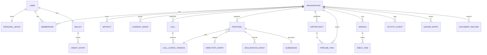

# Data model

> **What this is:** the persistent entities, their relationships and the tenancy rules.
> **Who reads it:** backend engineers.
> **Last reviewed:** 2026-10-02

The schema is managed with SQLAlchemy 2 (C1) and lives in `bizzagent/tenancy/models.py` and the
packages that own each entity. LangGraph checkpoints and the Store are separate (see the
[SAD](../architecture/SAD.md#3-containers-c4-level-2)).

| Entity | Key fields | Notes |
|---|---|---|
| `User` | id, phone_hash, language, name, created_at | Phone stored hashed plus encrypted |
| `PersonalSpace` | id, user_id | Reachable only through the owner's token |
| `Organization` | id, kind (`venture`\|`partner`), type, legal_form, partner_kind, name, slug, stage | `type` is one of explorer/team/business/collective/funder/program/support_org |
| `Membership` | org_id, user_id, role, authorised_signatory | Roles per [roles](../product/roles-and-permissions.md) |
| `Invitation` | org_id, phone_hash, role, consent?, expires_at | — |
| `ConsentGrant` | org_id, grantee_user_id, scope, artifact_ids, expires_at, revoked_at | Every access writes an `AuditEvent` |
| `Artifact` | id, org_id, kind, version, payload JSON, fields JSON (with provenance), produced_by | Append-only versions |
| `MediaFile` | id, org_id, kind, path, sha256, content_type, deleted_at | Stored outside the source tree |
| `Call` / `CallConfigVersion` | call: org_id, title, status; version: call_id, version, config JSON, sha256 | Versions are immutable |
| `DirectoryEntry` | id, name, url, instructions{lang}, verified_by | Off-platform funders |
| `Proposal` | id, org_id, call_config_version_id \| directory_entry_id, artifact_id | — |
| `DeclarationEvent` | proposal_id, declaration_id, kind (`understood`\|`ticked`), actor_user_id, actor_kind=`user`, language, at | Append-only; a `ticked` event must have `actor_kind=user` and a signatory |
| `Submission` | proposal_id, channel (`platform`\|`export`), at | — |
| `Opportunity` | id, type, title{lang}, provider_org_id \| directory_entry_id, url, deadline, rolling, benefit, eligibility JSON, languages, source JSON, status, last_checked_at, demo | — |
| `PipelineItem` | id, org_id, opportunity_id, stage, checklist JSON | — |
| `Mission` | id (= thread_id), org_id, goal, template, plan JSON, status, budget | — |
| `InboxItem` | id, org_id, mission_id, type, payload, status, decided_by, via | — |
| `Policy` | stored in the Store `("policies", org_id)` | — |
| `ActivityEvent` | id, org_id, mission_id?, agent, action, sources JSON, credits, at | — |
| `LedgerEntry` | id, org_id, date, amount, currency, direction, category, counterparty, provenance JSON, import_id? | — |
| `PersonalBudget` / `Goal` / `PersonalAsset` | personal_space_id, … | — |
| `JobOpening` / `Candidate` | org_id, …; candidate: no protected-attribute columns | — |
| `DocumentRecord` | id, org_id, artifact_id, version, format, language, sha256, provenance_summary JSON | Public verify returns a safe subset |
| `PassportShare` | id, org_id, token_hash, scope, expires_at, revoked_at | — |
| `Wallet` | id, owner (user \| org), cap, threshold | Balance = sum of `CreditEntry` |
| `CreditEntry` | id, txn_id, account, amount (+/−), at | Every `txn_id` sums to 0 |
| `PriceList` | version, effective_from, items JSON | — |
| `UsageEvent` | id, wallet_id, action, units, credits, run_id, price_list_version, status | — |
| `TopUp` | id, wallet_id, provider, provider_event_id (unique), amount, status | — |
| `ConnectorToken` | id, user_id, org_id, scopes, token_hash, revoked_at | — |
| `AuditEvent` | id, org_id?, actor, action, target, at, details | — |

## Tenancy rules

- Every org-owned table has `org_id NOT NULL`.
- Repositories take an `OrgScope(org_id, user_id, capabilities)`. There is **no unscoped
  query** in the request path. An architecture test checks that routes import only scoped
  repositories.
- Personal-space tables are keyed by `personal_space_id` and accessed only through
  `PersonalRepository(user)`.
- Before external organisations: PostgreSQL row-level security on the same columns.
