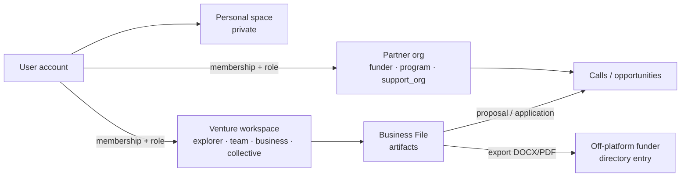

# Platform model

> **What this is:** the business objects of the platform: organisations, workspaces, the Business File, calls, opportunities, the directory, channels.
> **Who reads it:** product, engineers, partner managers.
> **Last reviewed:** 2026-10-02

Data shapes are in [data-model](../engineering/data-model.md). Roles are in
[roles-and-permissions](roles-and-permissions.md).

## 1. Organisations and workspaces

- Every person has an **account** and a **personal space** that only they can read.
- **Workspaces** are organisations of kind `venture` or `partner`.
  - Venture types: `explorer`, `team`, `business`, `collective`.
  - Partner types: `funder`, `program`, `support_org`.
- **Tenancy:** a shared database with `org_id` on every org-owned row, enforced in repositories
  and API dependencies. PostgreSQL row-level security comes before external organisations are
  onboarded ([ADR-0010](../architecture/adr/0010-organisations-and-tenancy.md)).

## 2. The Business File

The artifacts of a venture workspace are versioned, and every field carries provenance
([ADR-0007](../architecture/adr/0007-provenance-model.md)).

| Artifact | Built by |
|---|---|
| `BusinessProfile` | concierge, onboarding interview |
| `LegalSetupPlan` | business setup |
| `LaunchChecklist` | launch readiness |
| `IdeaCanvas` (versions), `ValidationPlan`, `EvidenceBoard` | idea skill |
| `MarketReport` | market research |
| `MarketEntryPlan` | market entry |
| `FinancialSheet` (calculations), `Ledger`, `Statements` | numbers, money coach |
| `Proposal` (one per call or directory entry) | funding skill |
| `OpportunityPipeline` | scout |
| `AcceleratorApplication` | accelerator coach |
| `JobOpening`, `CandidatePipeline` | hiring |
| `GrowthPlan` | growth coach |
| `DocumentExplanation` | document explainer |
| `JourneyPlan` | journey planner |
| `Document` (export, with hash) | exports |

## 3. Calls, opportunities and the directory

- **Opportunity:** a typed listing.
  - Types: `grant_call`, `incubator`, `accelerator`, `investor`, `hackathon`, `competition`,
    `fellowship`, `tender`, `trade_fair`, `loan_product`.
  - Sources: **platform** (published by a partner org), **curated** (human-verified, with URL
    and verifier) or **discovered** (found by search, with URL, `retrieved_at` and a page
    snapshot; never `verified` by the agent).
  - See [ADR-0019](../architecture/adr/0019-opportunity-catalogue.md).
- **Call:** an on-platform opportunity that accepts applications. Its configuration is
  versioned, immutable data ([ADR-0011](../architecture/adr/0011-call-configuration-as-data.md)):
  - form and field map (for the Common Application)
  - grid, eligibility gate, exclusions
  - declarations, languages, deadline, submission mode
- **Directory entry:** an off-platform funder or programme with submission instructions. Users
  export documents and submit them themselves.
- A proposal pins the call configuration version that was current when the proposal was created.

## 4. Channels

The web app is a responsive PWA, available now. Telegram, WhatsApp and IVR/USSD come later,
behind a channel-adapter interface
([ADR-0016](../architecture/adr/0016-channel-adapters.md)). Every channel feeds the same
concierge graph.
